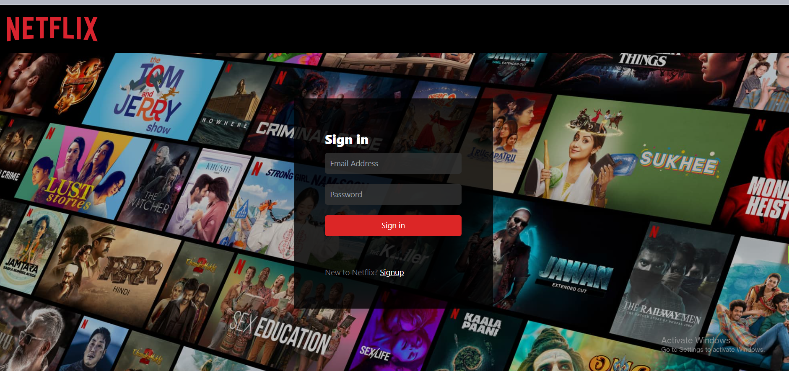
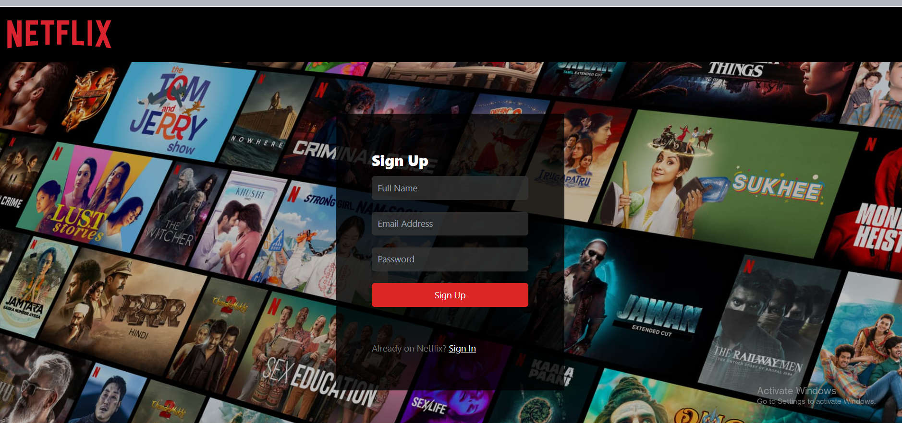
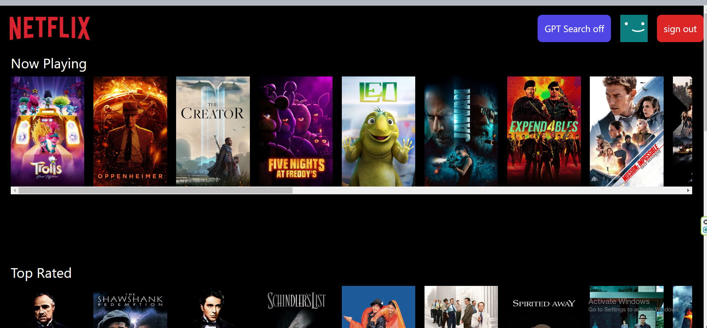
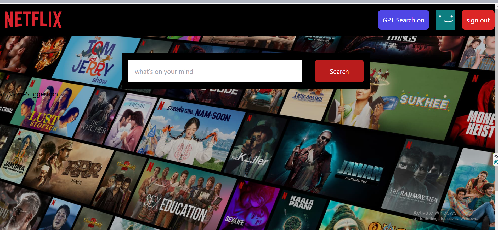

## Technologies :
- tailwindcss
- react hooks
- redux
- redux toolkit
## Features  :
- firebase authentication
- form validation using Regx
- routing
- protected routes
- tmdb apis for dynamic movie data
## Have a look at project :
- Sign In Page

---
- Sign Up Page

---
- Landing Page

---
- GPT Search Page

